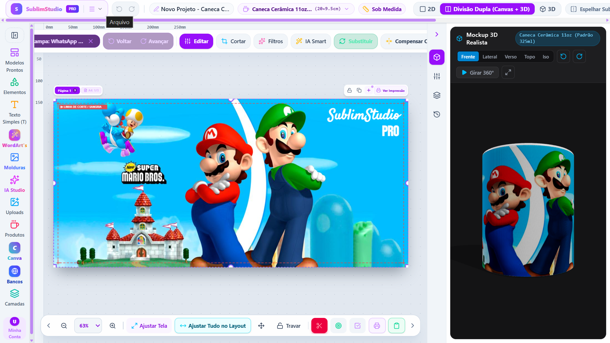
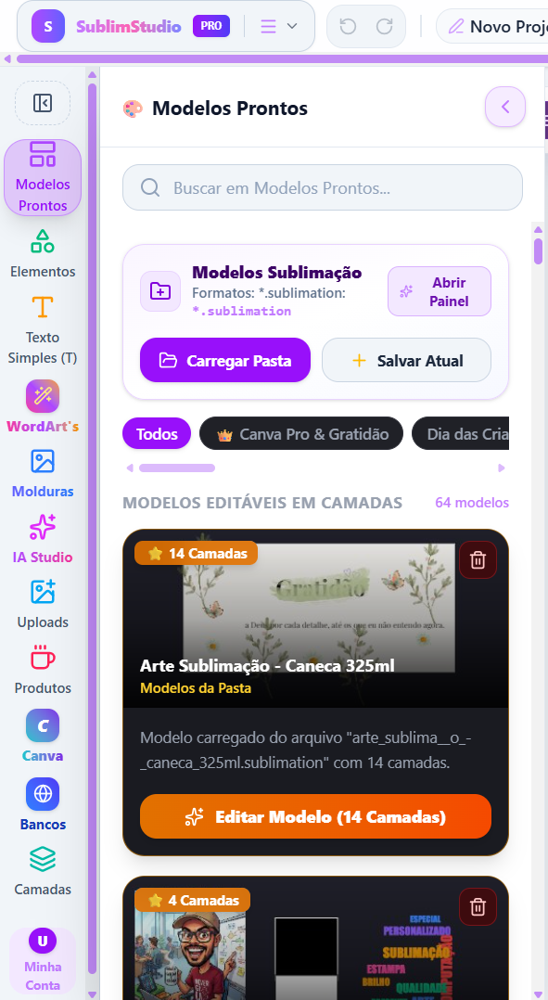
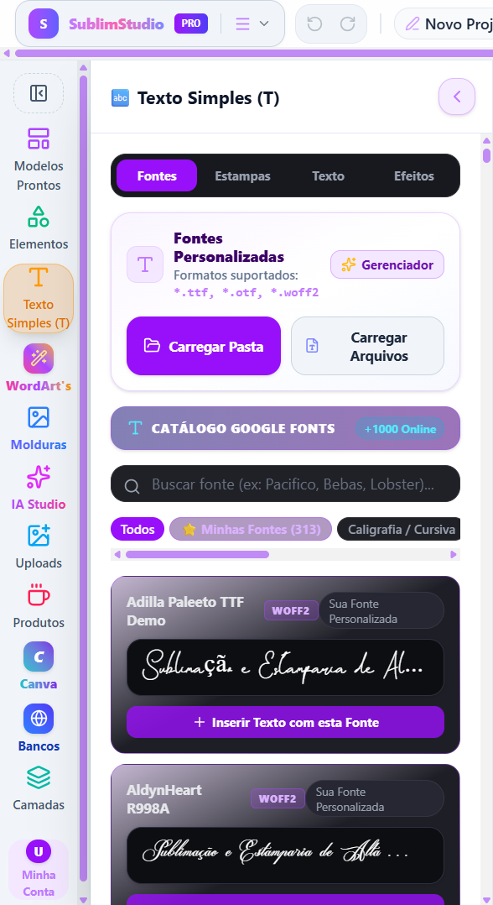
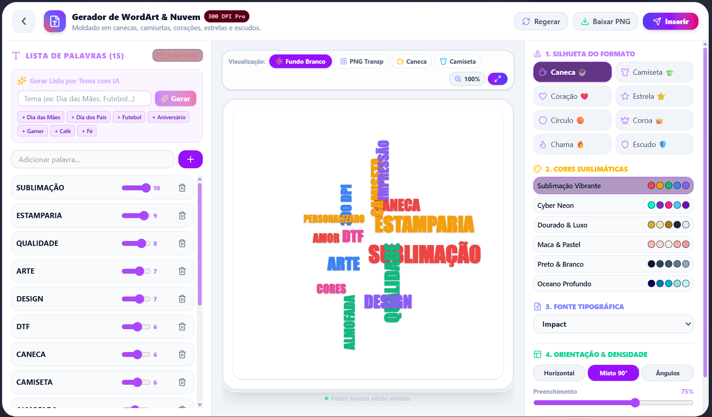
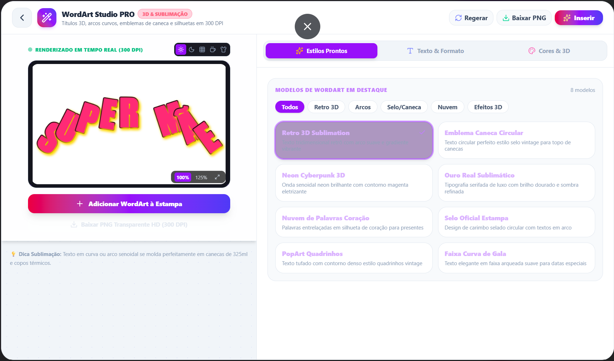
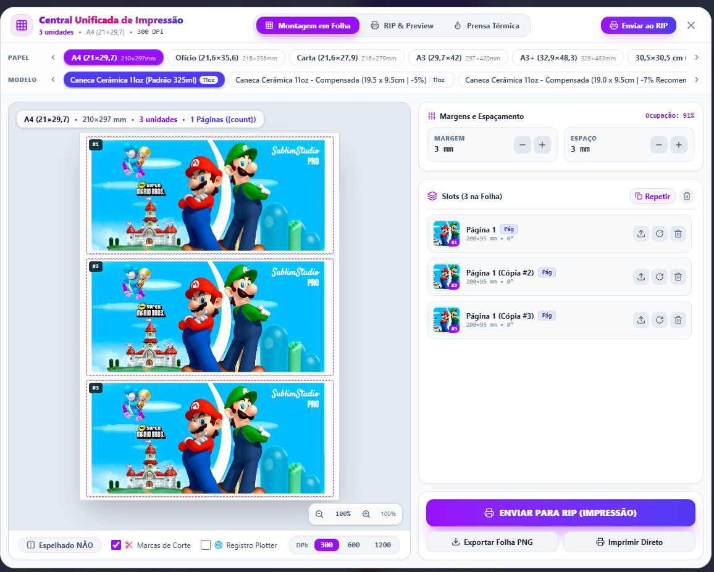
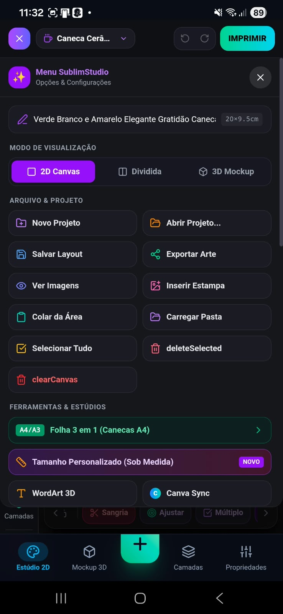
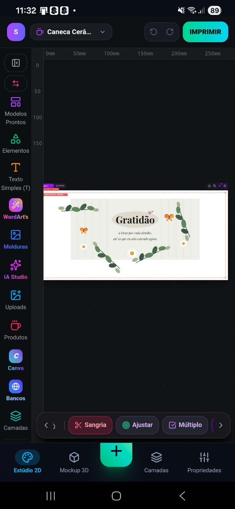
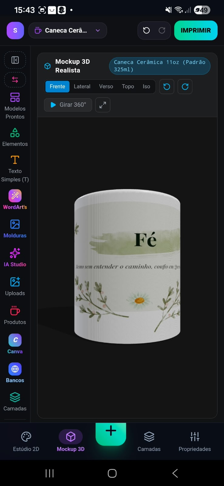

  <a href="#-português-pt-br">🇧🇷 Português (PT-BR)</a> •
  <a href="#-english-en">🇺🇸 English (EN)</a> •
  <a href="#-español-es">🇪🇸 Español (ES)</a>

---

# 🇧🇷 Português (PT-BR)

  

<h1 align="center">SublimStudio Pro</h1>

  <strong>Editor profissional de criação visual, personalização e preparação para sublimação.</strong>

  <a href="https://ai-sublimation-studio-pro.ai.studio">
    🚀 Acessar Aplicação
  </a>
  •
  <a href="https://github.com/ruitobias-eng/AI-Sublimation-Studio-Pro">
    💻 GitHub
  </a>

---

## 🎨 Sobre o Projeto

O **SublimStudio Pro** é uma plataforma de criação visual desenvolvida para profissionais de sublimação, personalização, estamparia, brindes, gráfica rápida e design.

A proposta é reunir em um único ambiente ferramentas de edição 2D, tipografia avançada, geração de elementos gráficos, inteligência artificial, bancos de imagens, mockups 3D e preparação de arquivos para impressão.

> **Desenvolvimento:** diBiTech®
> **Desenvolvedores:** Rui Tobias Carvalho & Rodrigo Carvalho

---

## ✨ Principais Recursos

### 🎨 Editor de Estampas e Produtos

Área de trabalho visual para criação e edição de artes com:

* Canvas 2D
* Sistema de camadas
* Guias e alinhamento
* Margem de segurança
* Sangria
* Transformação de objetos
* Rotação e redimensionamento
* Agrupamento de elementos
* Desfazer e refazer
* Preparação em alta resolução
* Fluxo otimizado para sublimação

### 🔤 WordArt Studio PRO

Ferramenta avançada para criação de textos e títulos:

* Textos curvados
* Efeitos 3D
* Neon
* Ouro e efeitos metálicos
* Retro 3D
* Selos
* Arcos
* Textos circulares
* Fontes OTF
* Fontes TTF
* Fontes WOFF2
* Google Fonts
* Controle avançado de tipografia

### ☁️ Nuvem de Palavras

Gerador visual de palavras com diferentes formatos e configurações:

* Caneca
* Camiseta
* Coração
* Estrela
* Círculo
* Coroa
* Chama
* Escudo
* Controle de frequência
* Densidade
* Orientação
* Paletas de cores
* Composição automática

### 🔳 QR Code Art

Criação de QR Codes personalizados para:

* Links
* Wi-Fi
* WhatsApp
* E-mail
* VCard
* SVG
* PNG
* Personalização visual

### 🤖 AI Studio

Ferramentas de inteligência artificial voltadas à criação de imagens para personalização:

* Floral Aquarela
* Cyberpunk
* Anime
* Pets
* Profissões
* Geração de imagens
* Preparação para produtos personalizados
* Fluxos em alta resolução

### 🖼️ Bancos de Imagens HD

Integração de recursos visuais para acelerar o processo criativo:

* Bancos de imagens
* Upload de arquivos
* Imagens em alta resolução
* Transparência
* Recursos gráficos
* Fluxo de inserção diretamente no editor

### 🧊 Mockup 3D em Tempo Real

Visualização da arte aplicada em produtos tridimensionais:

* Canecas
* Camisetas
* Almofadas
* Objetos personalizados
* Visualização frontal
* Lateral
* Verso
* Topo
* Isométrica
* Visualização 360°
* Renderização com Three.js/WebGL

### 🖨️ Central de Impressão

Preparação profissional dos trabalhos para impressão:

* Nesting automático
* A4
* A3
* A3+
* Ofício
* Carta
* Marcas de corte
* Organização das artes
* Espelhamento para sublimação
* Perfis de impressão
* Estimativa de aproveitamento
* Preparação para produção

---

## 🖼️ Galeria de Screenshots

### 🎨 Interface Principal

  

---

### 🔤 WordArt Studio PRO • ☁️ Nuvem de Palavras

<table>
  <tr>
    <td align="center" width="50%">
      <strong>WordArt Studio PRO</strong>  
      
    </td>
    <td align="center" width="50%">
      <strong>Nuvem de Palavras</strong>  
      
    </td>
  </tr>
</table>

---

### 🧩 Elementos e Formas • 🧊 Mockup 3D

<table>
  <tr>
    <td align="center" width="50%">
      <strong>Elementos e Formas</strong>  
      
    </td>
    <td align="center" width="50%">
      <strong>Mockup 3D</strong>  
      
    </td>
  </tr>
</table>

---

### 🖨️ Central de Impressão • Nesting

  

---

### 📱 Novas Interfaces

<table>
  <tr>
    <td align="center" width="33.33%">
      <strong>Interface 15</strong>  
      
    </td>
    <td align="center" width="33.33%">
      <strong>Interface 16</strong>  
      
    </td>
    <td align="center" width="33.33%">
      <strong>Interface 17</strong>  
      
    </td>
  </tr>
</table>

---

## 🧱 Arquitetura e Tecnologia

| Área           | Tecnologia               |
| -------------- | ------------------------ |
| Interface      | React + TypeScript       |
| Build          | Vite                     |
| Estilização    | Tailwind CSS             |
| Estado Global  | Zustand                  |
| Gráficos 2D    | Canvas API               |
| Vetores        | SVG                      |
| 3D             | Three.js + WebGL         |
| Performance    | Web Workers              |
| Aplicação      | PWA                      |
| Responsividade | Desktop, Tablet e Mobile |

---

## 📐 Sublimação e Alta Resolução

O SublimStudio Pro foi projetado considerando requisitos comuns de produção gráfica e sublimação.

### Resolução

* 300 DPI
* Exportação em alta resolução
* PNG com transparência
* SVG para elementos vetoriais
* PDF para fluxos de impressão

### Área de trabalho

* Formatos personalizados
* Proporção 4:5
* Área de sangria
* Margem de segurança
* Guias visuais
* Espelhamento para sublimação

### Produtos

Entre os formatos trabalhados estão:

* Canecas 11 oz
* Canecas 10 oz
* Canecas 3 oz
* Copos Shot
* Canecas cônicas
* Camisetas
* Almofadas
* Produtos personalizados

---

## 📱 Design Responsivo

O SublimStudio Pro foi concebido para funcionar em diferentes dispositivos.

### 🖥️ Desktop

* Área de trabalho ampla
* Ferramentas laterais
* Painel de propriedades
* Canvas central
* Mockup 3D

### 📱 Mobile

* Canvas sempre visível
* Ferramentas acessíveis por toque
* Barra inferior
* Controles adaptados
* Interface otimizada para telas menores

### 📲 Tablet

* Interface híbrida
* Canvas central
* Painéis adaptáveis
* Controles touch

O princípio central da interface é:

> **Canvas Sempre Visível**

O usuário deve conseguir visualizar a arte enquanto utiliza as ferramentas de criação.

---
---

## 🔮 Direção do Projeto

O SublimStudio Pro está em desenvolvimento ativo com foco em transformar o processo de:

**criação → edição → visualização → preparação → impressão**

em um fluxo integrado.

Entre as áreas de evolução estão:

* Editor 2D avançado
* WordArt Studio PRO
* IA generativa
* Mockups 3D
* Preparação automática para impressão
* Nesting
* Perfis de impressão
* Otimização de desempenho
* Experiência mobile
* Fluxos profissionais de produção

---

## 📌 Status

> 🚧 **Projeto em desenvolvimento ativo**

Novos recursos, melhorias de interface, otimizações de performance e ferramentas de produção estão sendo incorporados continuamente.

---

## 👨‍💻 Desenvolvimento

**diBiTech®**

Desenvolvido por:

**Rui Tobias Carvalho**
**Rodrigo Carvalho**

---

# 🇺🇸 English (EN)

  

<h1 align="center">SublimStudio Pro</h1>

  <strong>Professional visual editor for design, customization, and sublimation preparation.</strong>

  <a href="https://ai-sublimation-studio-pro.ai.studio">
    🚀 Open Application
  </a>
  •
  <a href="https://github.com/ruitobias-eng/AI-Sublimation-Studio-Pro">
    💻 GitHub
  </a>

---

## 🎨 About the Project

**SublimStudio Pro** is a comprehensive visual creation platform tailored for professionals in sublimation, customization, apparel, print shops, merchandise, and graphic design.

It brings together 2D editing tools, advanced typography, graphic generators, AI Studio, HD image banks, 3D mockups, and print-ready workflows into a single workspace.

> **Development:** diBiTech®
> **Developers:** Rui Tobias Carvalho & Rodrigo Carvalho

---

## ✨ Key Features

### 🎨 Print & Product Editor

A visual workspace featuring:

* 2D Canvas
* Layer system
* Guides and alignment
* Safe margins
* Bleed area
* Object transformation
* Rotation and resizing
* Object grouping
* Undo and redo
* High-resolution workflow
* Sublimation-oriented production flow

### 🔤 WordArt Studio PRO

Advanced typography creation tools:

* Curved text
* 3D effects
* Neon
* Gold and metallic effects
* Retro 3D
* Badges
* Arcs
* Circular text
* OTF fonts
* TTF fonts
* WOFF2 fonts
* Google Fonts
* Advanced typography controls

### ☁️ Word Cloud Generator

Visual word cloud generation with multiple shapes and controls:

* Mug
* T-shirt
* Heart
* Star
* Circle
* Crown
* Flame
* Shield
* Frequency
* Density
* Orientation
* Color palettes
* Automatic composition

### 🔳 QR Code Art

Create customized QR Codes for:

* Links
* Wi-Fi
* WhatsApp
* E-mail
* VCard
* SVG
* PNG
* Visual customization

### 🤖 AI Studio

AI-powered image generation tools designed for personalization:

* Watercolor Floral
* Cyberpunk
* Anime
* Pets
* Professions
* Image generation
* High-resolution workflows
* Custom product creation

### 🖼️ HD Image Banks

Visual resources integrated into the creative workflow:

* Image banks
* File uploads
* High-resolution images
* Transparency
* Graphic resources
* Direct insertion into the editor

### 🧊 Real-Time 3D Mockup

Preview artwork applied to 3D products:

* Mugs
* T-shirts
* Pillows
* Customized products
* Front view
* Side view
* Back view
* Top view
* Isometric view
* 360° visualization
* Three.js/WebGL rendering

### 🖨️ Print Hub & Nesting

Professional print preparation:

* Automatic nesting
* A4
* A3
* A3+
* Legal
* Letter
* Cut marks
* Artwork organization
* Sublimation mirroring
* Print profiles
* Material optimization
* Production preparation

---

## 🖼️ Screenshot Gallery

### 🎨 Main Interface

  

---

### 🔤 WordArt Studio PRO • ☁️ Word Cloud Generator

<table>
  <tr>
    <td align="center" width="50%">
      <strong>WordArt Studio PRO</strong>  
      
    </td>
    <td align="center" width="50%">
      <strong>Word Cloud Generator</strong>  
      
    </td>
  </tr>
</table>

---

### 🧩 Elements & Shapes • 🧊 3D Mockup

<table>
  <tr>
    <td align="center" width="50%">
      <strong>Elements & Shapes</strong>  
      
    </td>
    <td align="center" width="50%">
      <strong>3D Mockup</strong>  
      
    </td>
  </tr>
</table>

---

### 🖨️ Print Hub • Nesting

  

---

### 📱 New Interfaces

<table>
  <tr>
    <td align="center" width="33.33%">
      <strong>Interface 15</strong>  
      
    </td>
    <td align="center" width="33.33%">
      <strong>Interface 16</strong>  
      
    </td>
    <td align="center" width="33.33%">
      <strong>Interface 17</strong>  
      
    </td>
  </tr>
</table>

---

## 🧱 Architecture & Technology

| Area              | Technology                 |
| ----------------- | -------------------------- |
| UI & Framework    | React + TypeScript         |
| Build             | Vite                       |
| Styling           | Tailwind CSS               |
| State Management  | Zustand                    |
| 2D Graphics       | Canvas API                 |
| Vector Graphics   | SVG                        |
| 3D Rendering      | Three.js + WebGL           |
| Performance       | Web Workers                |
| Application       | PWA                        |
| Responsive Design | Desktop, Tablet and Mobile |

---

## 📐 Sublimation & High Resolution

SublimStudio Pro is designed around common requirements for professional sublimation and graphic production.

### Resolution

* 300 DPI
* High-resolution export
* Transparent PNG
* SVG
* Print-ready PDF

### Workspace

* Custom formats
* 4:5 composition
* Bleed area
* Safe margins
* Visual guides
* Sublimation mirroring

### Products

Supported product formats include:

* 11 oz mugs
* 10 oz mugs
* 3 oz mugs
* Shot cups
* Tapered mugs
* T-shirts
* Pillows
* Customized products

---

## 📱 Responsive Design

SublimStudio Pro is designed for multiple device categories.

### 🖥️ Desktop

* Large workspace
* Side toolbars
* Properties panel
* Central canvas
* 3D mockup

### 📱 Mobile

* Always-visible canvas
* Touch-friendly tools
* Bottom toolbar
* Adaptive controls
* Small-screen optimized interface

### 📲 Tablet

* Hybrid interface
* Central canvas
* Adaptive panels
* Touch controls

The core interface principle is:

> **Canvas Always Visible**

Users should be able to see their artwork while working with the creation tools.

---
---

## 🔮 Project Direction

SublimStudio Pro is being developed around an integrated workflow:

**creation → editing → visualization → preparation → printing**

Current development areas include:

* Advanced 2D editor
* WordArt Studio PRO
* Generative AI
* 3D mockups
* Automated print preparation
* Nesting
* Print profiles
* Performance optimization
* Mobile experience
* Professional production workflows

---

## 📌 Status

> 🚧 **Active development**

New features, interface improvements, performance optimizations, and production tools are continuously being incorporated.

---

## 👨‍💻 Development

**diBiTech®**

Developed by:

**Rui Tobias Carvalho**
**Rodrigo Carvalho**

---

# 🇪🇸 Español (ES)

  

<h1 align="center">SublimStudio Pro</h1>

  <strong>Editor profesional de creación visual, personalización y preparación para sublimación.</strong>

  <a href="https://ai-sublimation-studio-pro.ai.studio">
    🚀 Abrir Aplicación
  </a>
  •
  <a href="https://github.com/ruitobias-eng/AI-Sublimation-Studio-Pro">
    💻 GitHub
  </a>

---

## 🎨 Sobre el Proyecto

**SublimStudio Pro** es una plataforma de creación visual desarrollada para profesionales de la sublimación, personalización de productos, confección, imprentas rápidas, merchandising y diseño gráfico.

El objetivo es reunir en un solo lugar herramientas de edición 2D, tipografía avanzada, generación de elementos gráficos, inteligencia artificial, bancos de imágenes HD, maquetas 3D y preparación de archivos listos para impresión.

> **Desarrollo:** diBiTech®
> **Desarrolladores:** Rui Tobias Carvalho & Rodrigo Carvalho

---

## ✨ Principales Funciones

### 🎨 Editor de Diseños y Productos

Espacio de trabajo visual con:

* Canvas 2D
* Sistema de capas
* Guías y alineación
* Margen de seguridad
* Sangrado
* Transformación de objetos
* Rotación y redimensionamiento
* Agrupación
* Deshacer y rehacer
* Alta resolución
* Flujo orientado a sublimación

### 🔤 WordArt Studio PRO

Herramientas avanzadas de tipografía:

* Texto curvado
* Efectos 3D
* Neon
* Oro y efectos metálicos
* Retro 3D
* Sellos
* Arcos
* Texto circular
* Fuentes OTF
* Fuentes TTF
* Fuentes WOFF2
* Google Fonts
* Controles tipográficos avanzados

### ☁️ Generador de Nubes de Palabras

Generación de composiciones con diferentes formas:

* Taza
* Camiseta
* Corazón
* Estrella
* Círculo
* Corona
* Llama
* Escudo
* Frecuencia
* Densidad
* Orientación
* Paletas de colores
* Composición automática

### 🔳 QR Code Art

Creación de códigos QR personalizados para:

* Enlaces
* Wi-Fi
* WhatsApp
* E-mail
* VCard
* SVG
* PNG
* Personalización visual

### 🤖 AI Studio

Herramientas de inteligencia artificial para creación de imágenes:

* Floral Acuarela
* Cyberpunk
* Anime
* Mascotas
* Profesiones
* Generación de imágenes
* Alta resolución
* Productos personalizados

### 🖼️ Bancos de Imágenes HD

Recursos visuales integrados en el flujo creativo:

* Bancos de imágenes
* Carga de archivos
* Imágenes de alta resolución
* Transparencia
* Recursos gráficos
* Inserción directa en el editor

### 🧊 Mockup 3D en Tiempo Real

Visualización de diseños aplicados a productos tridimensionales:

* Tazas
* Camisetas
* Almohadas
* Productos personalizados
* Vista frontal
* Vista lateral
* Vista trasera
* Vista superior
* Vista isométrica
* Visualización 360°
* Three.js/WebGL

### 🖨️ Central de Impresión

Preparación profesional:

* Nesting automático
* A4
* A3
* A3+
* Oficio
* Carta
* Marcas de corte
* Organización de diseños
* Espejado para sublimación
* Perfiles de impresión
* Optimización del material
* Preparación para producción

---

## 🖼️ Galería de Capturas

### 🎨 Interfaz Principal

  

---

### 🔤 WordArt Studio PRO • ☁️ Generador de Nubes de Palabras

<table>
  <tr>
    <td align="center" width="50%">
      <strong>WordArt Studio PRO</strong>  
      
    </td>
    <td align="center" width="50%">
      <strong>Generador de Nubes de Palabras</strong>  
      
    </td>
  </tr>
</table>

---

### 🧩 Elementos y Formas • 🧊 Mockup 3D

<table>
  <tr>
    <td align="center" width="50%">
      <strong>Elementos y Formas</strong>  
      
    </td>
    <td align="center" width="50%">
      <strong>Mockup 3D</strong>  
      
    </td>
  </tr>
</table>

---

### 🖨️ Central de Impresión • Nesting

  

---

### 📱 Nuevas Interfaces

<table>
  <tr>
    <td align="center" width="33.33%">
      <strong>Interfaz 15</strong>  
      
    </td>
    <td align="center" width="33.33%">
      <strong>Interfaz 16</strong>  
      
    </td>
    <td align="center" width="33.33%">
      <strong>Interfaz 17</strong>  
      
    </td>
  </tr>
</table>

---

## 🧱 Arquitectura y Tecnología

| Área                 | Tecnología                     |
| -------------------- | ------------------------------ |
| Interfaz             | React + TypeScript             |
| Build                | Vite                           |
| Estilos              | Tailwind CSS                   |
| Gestión de Estado    | Zustand                        |
| Gráficos 2D          | Canvas API                     |
| Gráficos Vectoriales | SVG                            |
| Renderizado 3D       | Three.js + WebGL               |
| Rendimiento          | Web Workers                    |
| Aplicación           | PWA                            |
| Diseño Responsivo    | Escritorio, tabletas y móviles |

---

## 📐 Sublimación y Alta Resolución

SublimStudio Pro está diseñado teniendo en cuenta requisitos habituales de producción gráfica y sublimación.

### Resolución

* 300 DPI
* Exportación de alta resolución
* PNG transparente
* SVG
* PDF listo para impresión

### Área de Trabajo

* Formatos personalizados
* Composición 4:5
* Sangrado
* Margen de seguridad
* Guías visuales
* Espejado para sublimación

### Productos

Entre los formatos compatibles:

* Tazas de 11 oz
* Tazas de 10 oz
* Tazas de 3 oz
* Vasos Shot
* Tazas cónicas
* Camisetas
* Almohadas
* Productos personalizados

---

## 📱 Diseño Responsivo

SublimStudio Pro está diseñado para diferentes dispositivos.

### 🖥️ Escritorio

* Espacio de trabajo amplio
* Barras laterales
* Panel de propiedades
* Canvas central
* Mockup 3D

### 📱 Móvil

* Canvas siempre visible
* Herramientas táctiles
* Barra inferior
* Controles adaptativos
* Interfaz optimizada para pantallas pequeñas

### 📲 Tablet

* Interfaz híbrida
* Canvas central
* Paneles adaptativos
* Controles táctiles

El principio central de la interfaz es:

> **Canvas Siempre Visible**

El usuario puede visualizar su diseño mientras utiliza las herramientas de creación.

---
---

## 🔮 Dirección del Proyecto

SublimStudio Pro está siendo desarrollado alrededor de un flujo integrado:

**creación → edición → visualización → preparación → impresión**

Las áreas de evolución incluyen:

* Editor 2D avanzado
* WordArt Studio PRO
* IA generativa
* Mockups 3D
* Preparación automática para impresión
* Nesting
* Perfiles de impresión
* Optimización de rendimiento
* Experiencia móvil
* Flujos profesionales de producción

---

## 📌 Estado

> 🚧 **Proyecto en desarrollo activo**

Se incorporan continuamente nuevas funciones, mejoras de interfaz, optimizaciones de rendimiento y herramientas para producción.

---

## 👨‍💻 Desarrollo

**diBiTech®**

Desarrollado por:

**Rui Tobias Carvalho**
**Rodrigo Carvalho**

---

  Developed with ❤️ by <strong>diBiTech®</strong>

