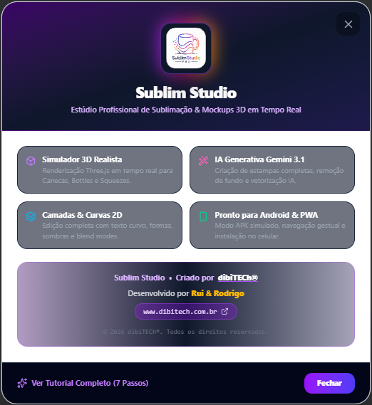
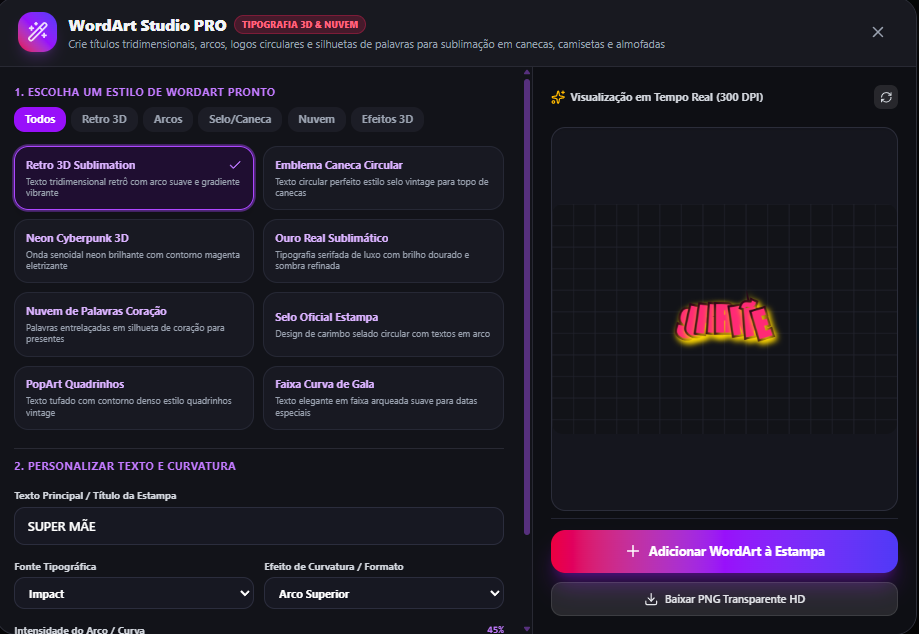
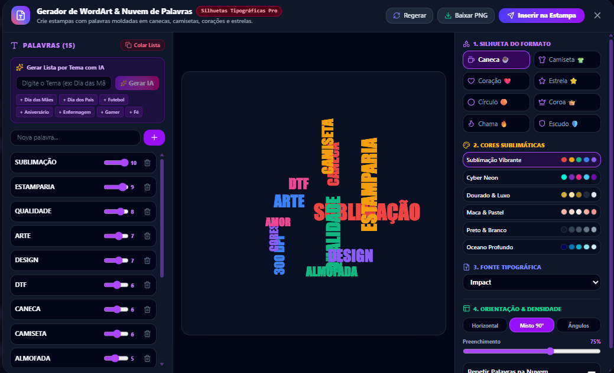
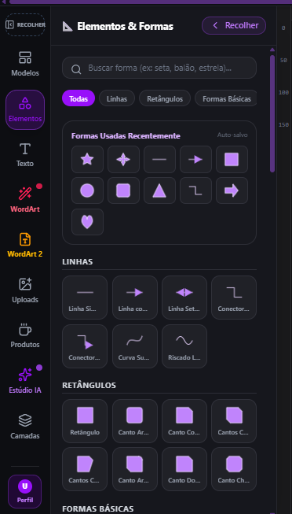
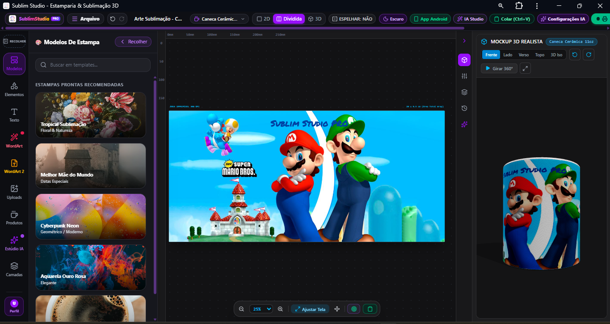

# 🎨 SublimStudio Pro

<p align="center">
  
</p>

<h3 align="center">Estúdio Profissional de Sublimação, Ilustração e Mockups 3D em Tempo Real</h3>

<p align="center">
  <strong>Crie. Personalize. Visualize. Prepare para produção.</strong>
</p>

<p align="center">
  
  
  
  
</p>

---

## 🚀 Sobre o projeto

O **SublimStudio Pro** é um ambiente de criação visual desenvolvido para profissionais de **sublimação, personalização, estamparia, brindes e produção gráfica**.

A proposta é reunir em um único espaço ferramentas que normalmente ficam espalhadas entre diferentes programas: edição de elementos, tipografia, WordArt, criação de nuvens de palavras, modelos de estampas, preparação visual e **visualização 3D do produto**.

O projeto está sendo construído com foco em uma experiência moderna de estúdio criativo, combinando **edição 2D + recursos de IA + mockups 3D + fluxo de produção**.

> ⚠️ **Status:** projeto em desenvolvimento ativo. Algumas funções, integrações e ferramentas ainda podem estar sendo aprimoradas.

---

## ✨ Principais recursos

### 🖌️ Editor de Estampas

- Área de criação visual para estampas.
- Edição de textos e elementos.
- Organização por camadas.
- Formas geométricas e elementos gráficos.
- Controles de composição e posicionamento.
- Interface pensada para fluxo de trabalho de sublimação.

### 🔤 WordArt Studio PRO

Ferramentas especializadas para criação de tipografias decorativas:

- Texto em arco.
- Texto circular para canecas.
- Efeitos 3D.
- Neon e estilos gráficos.
- Selos e emblemas.
- Faixas curvas.
- Tipografias para camisetas, canecas e almofadas.
- Pré-visualização em alta resolução.

<p align="center">
  
</p>

---

### ☁️ Gerador de WordArt & Nuvem de Palavras

Criação de composições tipográficas a partir de listas de palavras ou temas:

- Geração de listas por tema.
- Controle de intensidade das palavras.
- Silhuetas personalizadas.
- Formatos como:
  - ☕ Caneca
  - 👕 Camiseta
  - ❤️ Coração
  - ⭐ Estrela
  - ⭕ Círculo
  - 👑 Coroa
  - 🔥 Chama
  - 🛡️ Escudo
- Controle de orientação.
- Densidade e preenchimento.
- Escolha de fontes.
- Paletas de cores para sublimação.
- Inserção direta na estampa.

<p align="center">
  
</p>

---

### 🔷 Elementos & Formas

Biblioteca visual para acelerar a criação:

- Linhas.
- Setas.
- Conectores.
- Curvas.
- Retângulos.
- Polígonos.
- Formas básicas.
- Formas utilizadas recentemente.
- Busca de elementos.
- Categorias de formas.
- Reutilização rápida de elementos.

<p align="center">
  
</p>

---

### 🧠 Estúdio IA

O projeto possui uma área dedicada a recursos de Inteligência Artificial para auxiliar no processo criativo.

A visão do módulo inclui:

- Geração de ideias visuais.
- Criação de elementos para estampas.
- Remoção de fundo.
- Vetorização.
- Upscaling.
- Assistência na criação de artes.
- Fluxos orientados para sublimação.

A integração de IA está sendo evoluída conforme o projeto avança.

---

### 🧊 Mockup 3D em tempo real

Uma das características centrais do SublimStudio Pro é a visualização da arte aplicada ao produto.

O ambiente 3D foi pensado para trabalhar com diferentes produtos e visualizações:

- Canecas.
- Camisetas.
- Almofadas.
- Objetos personalizados.
- Visualização frontal.
- Lateral.
- Traseira.
- Superior.
- Rotação 360°.
- Pré-visualização da aplicação da arte.

<p align="center">
  
</p>

---

## 🎯 Para quem é

O SublimStudio Pro foi pensado principalmente para:

| Público | Utilização |
|---|---|
| 🎨 Sublimadores | Criação e preparação de estampas |
| 👕 Personalizados | Camisetas, canecas, almofadas e brindes |
| 🖨️ Gráficas rápidas | Criação de materiais personalizados |
| 🧑‍🎨 Designers | Composição e edição visual |
| 🏪 Pequenos negócios | Produção de artes para produtos |
| 🧪 Criadores | Experimentação de conceitos e estilos |
| 📦 Produção personalizada | Visualização antes da fabricação |

---

## 🧩 Visão do produto

O objetivo do SublimStudio Pro é evoluir para um **estúdio visual especializado em personalização**, reduzindo a necessidade de alternar entre várias ferramentas.

```text
                  SUBLIMSTUDIO PRO
                         │
        ┌────────────────┼────────────────┐
        │                │                │
     EDITOR 2D        ESTÚDIO IA       MOCKUP 3D
        │                │                │
   ┌────┼────┐       ┌───┼────┐      ┌────┼────┐
   │    │    │       │   │    │      │    │    │
 Texto Formas WordArt  IA  Vetor  Caneca Camiseta Produtos
   │    │    │       │   │    │      │    │    │
   └────┴────┴───────┴───┴────┴──────┴────┴────┘
                         │
                    PRODUÇÃO
                         │
               ┌─────────┴─────────┐
               │                   │
             PNG / HD          Sublimação
```

---

## 🖥️ Interface

A interface foi projetada como um ambiente de desenvolvimento visual, com:

- Barra superior de comandos.
- Barra lateral de ferramentas.
- Painel de modelos.
- Área central de edição.
- Painéis de propriedades.
- Camadas.
- Ferramentas de WordArt.
- Estúdio IA.
- Visualização 3D.
- Controles de zoom e navegação.
- Suporte a tema escuro.
- Preparação para experiência PWA/mobile.

---

## 📱 PWA e Android

O projeto também possui uma visão voltada para utilização em dispositivos móveis.

Objetivos:

- Aplicação instalável.
- PWA.
- Interface responsiva.
- Navegação adaptada para touch.
- Utilização em Android.
- Experiência de edição otimizada para telas menores.

---

## 🛠️ Tecnologias

A arquitetura do projeto está sendo construída em torno de tecnologias modernas para aplicações web interativas.

**Frontend**

- React
- TypeScript
- Vite
- Tailwind CSS

**Estado e arquitetura**

- Zustand
- Componentização modular
- Arquitetura orientada a ferramentas e engines

**Gráficos e 3D**

- Canvas API
- Three.js
- Renderização 2D/3D
- Manipulação de elementos gráficos

**Aplicação**

- PWA
- Preparação para Android/Desktop
- Armazenamento local
- Fluxo local-first

> A stack pode evoluir durante o desenvolvimento conforme novas necessidades técnicas forem identificadas.

---

## 📐 Fluxo de trabalho

Um fluxo típico dentro do SublimStudio Pro:

```text
1. Escolher produto
       ↓
2. Criar ou abrir uma estampa
       ↓
3. Inserir textos, imagens e formas
       ↓
4. Criar WordArt / Nuvem de Palavras
       ↓
5. Ajustar cores e composição
       ↓
6. Utilizar recursos de IA
       ↓
7. Visualizar no Mockup 3D
       ↓
8. Revisar medidas e posicionamento
       ↓
9. Exportar a arte
       ↓
10. Produzir / Sublimar
```

---

## 🗺️ Roadmap

### ✅ Base do projeto

- [x] Interface principal
- [x] Editor visual
- [x] Sistema de ferramentas
- [x] Modelos de estampas
- [x] Elementos e formas
- [x] WordArt
- [x] Nuvem de palavras
- [x] Painel de camadas
- [x] Mockup 3D
- [x] Interface para PWA

### 🚧 Em desenvolvimento

- [ ] Aperfeiçoamento do Canvas Engine
- [ ] Mais produtos 3D
- [ ] Sistema avançado de deformação para superfícies
- [ ] Exportação profissional para impressão
- [ ] Fluxos avançados de IA
- [ ] Vetorização aprimorada
- [ ] Biblioteca de templates
- [ ] Mais ferramentas touch/mobile
- [ ] Melhorias de acessibilidade
- [ ] Otimização de performance

### 🔮 Futuro

- [ ] Mais mockups 3D
- [ ] Editor vetorial avançado
- [ ] Sistema de preparação para diferentes processos de impressão
- [ ] Biblioteca profissional de materiais
- [ ] Automação de tarefas repetitivas
- [ ] Marketplace/biblioteca de recursos
- [ ] Integrações adicionais

---

## 🧪 Projeto em desenvolvimento

Este repositório representa o desenvolvimento do **SublimStudio Pro** e pode conter funcionalidades experimentais.

A arquitetura está sendo construída de forma incremental, priorizando:

- estabilidade;
- performance;
- experiência do usuário;
- modularidade;
- compatibilidade web;
- experiência touch;
- reutilização de componentes;
- evolução do editor sem perder simplicidade.

---

## 📸 Galeria

### Interface principal


### WordArt Studio PRO


### Nuvem de palavras


### Elementos e formas


### Editor + Mockup 3D


---

## ⚡ Instalação

Clone o projeto:

```bash
git clone SEU_REPOSITORIO_AQUI
cd SEU_PROJETO
```

Instale as dependências:

```bash
npm install
```

Execute em desenvolvimento:

```bash
npm run dev
```

Para gerar a versão de produção:

```bash
npm run build
```

Para testar a build:

```bash
npm run preview
```

> Ajuste os comandos acima caso o `package.json` do projeto utilize outro gerenciador ou scripts personalizados.

---

## 🤝 Contribuição

Sugestões, ideias e melhorias são bem-vindas.

Antes de enviar uma contribuição:

1. Faça um fork do projeto.
2. Crie uma branch para sua alteração.
3. Faça as modificações.
4. Teste a aplicação.
5. Envie um Pull Request descrevendo o que foi alterado.

---

## 📄 Licença

Defina aqui a licença escolhida para o projeto.

Exemplo:

```text
Copyright © 2026 diBiTech®
SublimStudio Pro
```

---

## 👨‍💻 Desenvolvimento

**SublimStudio Pro**  
Criado por **diBiTech®**

Desenvolvimento: **Rui & Rodrigo**

Projeto dedicado ao desenvolvimento de ferramentas para **sublimação, personalização, ilustração e visualização 3D**.

---

## 🌐 Links

- 🌎 Website: **https://www.dibitech.com.br**
- 📦 Repositório: **adicione o link do GitHub**
- 🚀 Demo: **adicione o link da aplicação**
- 📚 Documentação: **adicione quando disponível**

---

<p align="center">
  <strong>🎨 SublimStudio Pro</strong><br>
  <sub>Do desenho à peça pronta, em um único estúdio.</sub>
</p>

<p align="center">
  © 2026 diBiTech® • SublimStudio Pro
</p>
